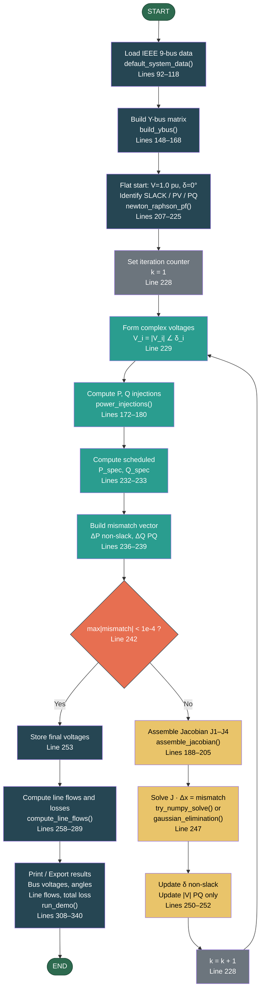

# Newton–Raphson Load Flow — Flowchart

```mermaid
flowchart TD
    A([START]) --> B["Load IEEE 9-bus data\ndefault_system_data()\nLines 92–118"]
    B --> C["Build Y-bus matrix\nbuild_ybus()\nLines 148–168"]
    C --> D["Flat start: V=1.0 pu, δ=0°\nIdentify SLACK / PV / PQ\nnewton_raphson_pf()\nLines 207–225"]
    D --> E["Set iteration counter\nk = 1\nLine 228"]
    E --> F["Form complex voltages\nV_i = |V_i| ∠ δ_i\nLine 229"]
    F --> G["Compute P, Q injections\npower_injections()\nLines 172–180"]
    G --> H["Compute scheduled\nP_spec, Q_spec\nLines 232–233"]
    H --> I["Build mismatch vector\nΔP non-slack, ΔQ PQ\nLines 236–239"]
    I --> J{"max|mismatch| < 1e-4 ?\nLine 242"}
    J -- Yes --> K["Store final voltages\nLine 253"]
    J -- No --> L["Assemble Jacobian J1–J4\nassemble_jacobian()\nLines 188–205"]
    L --> M["Solve J · Δx = mismatch\ntry_numpy_solve() or\ngaussian_elimination()\nLine 247"]
    M --> N["Update δ non-slack\nUpdate |V| PQ only\nLines 250–252"]
    N --> O["k = k + 1\nLine 228"]
    O --> F
    K --> P["Compute line flows and losses\ncompute_line_flows()\nLines 258–289"]
    P --> Q["Print / Export results\nBus voltages, angles\nLine flows, total loss\nrun_demo()\nLines 308–340"]
    Q --> R([END])

    style A fill:#2d6a4f,color:#fff,stroke:#1b4332
    style R fill:#2d6a4f,color:#fff,stroke:#1b4332
    style J fill:#e76f51,color:#fff,stroke:#264653
    style B fill:#264653,color:#fff
    style C fill:#264653,color:#fff
    style D fill:#264653,color:#fff
    style F fill:#2a9d8f,color:#fff
    style G fill:#2a9d8f,color:#fff
    style H fill:#2a9d8f,color:#fff
    style I fill:#2a9d8f,color:#fff
    style L fill:#e9c46a,color:#000
    style M fill:#e9c46a,color:#000
    style N fill:#e9c46a,color:#000
    style K fill:#264653,color:#fff
    style P fill:#264653,color:#fff
    style Q fill:#264653,color:#fff
    style E fill:#6c757d,color:#fff
    style O fill:#6c757d,color:#fff
```